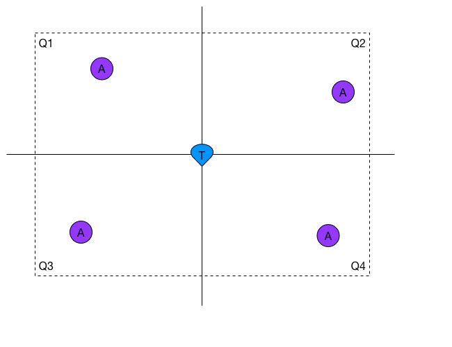
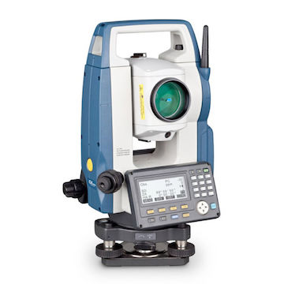

# Anchor Placement
The anchors serve as the reference points of your system. They are similar to the satellites in a GPS system.
It is crucial that they are put on a strategic place and that their coordinates are calculated very accurately.

## Placement Strategy

There are some rules of thumb to keep in mind when you are placing your anchors in order to get the most out of your system.

### 1. Anchor in each Quadrant
For every possible position the tags can come, you want to have at least one anchor in every quadrant around that position.
This makes that the underlying mathematical problem is _well-conditioned_, which basically means that errors in the measurements have a smaller influence on the error of the calculated position.

### 2. Daisy-chain Anchors
Try to put the anchors such that every anchor sees at least a couple other anchors.
Doing this makes the time synchronization between the anchors easier and thus more accurate.

### 3. Keep LOS in mind
Any object that is in between the `Line of Sight` between an anchor and a tag will have a certain influence on the measurement.
Some objects are worse than others. Metal, concrete and fluids for example can severely attenuate the UWB signal and increase the measured distance.

### 4. Keep the Antenna away from metal
Aim your antenna well and make sure it doesn't have any metal objects nearby.

## Calculating Anchor Coordinates
### AutoPositioning
The easiest way to calculate the coordinates of the anchors is by using the built-in function `AutoPos`.
The AutoPos algorithm has two main steps:
 1. Range between all anchors
 2. Run a mathematical model to map the anchors

This procedure is quite convenient, but you need to keep in mind that this is only useful in small setups with a small amount of anchors deployed (typically up to 6).
When more anchors are used, the algorithm will still work but the results might become unreliable. Especially when there are some missing measurements between some anchors because they are out of range for each other.
The returned anchor coordinates are a relative reference system. You can give the coordinates an offset or rotate them around the zero-point.

You can find a step-by-step guide on how to use the AutoPos [here](LINK).

### Total Station
A total station (TS) is an electronic/optical instrument that is mostly used for surveying and building construction.
It allows you to very accurately (up to a few millimeters in all directions) measure the coordinates of static points in your scene.
In our case, those static points will be the anchors.
This is what a TS can look like:

If you want to achieve as accurate results as possible, you should always consider using a TS to calculate the coordinates of your anchors.

