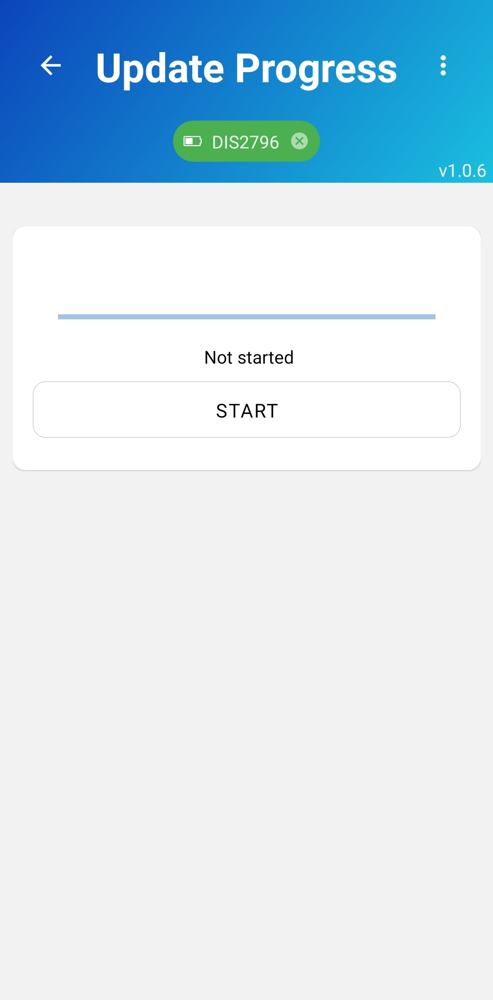

# Updating firmware

There are a few methods to change a device's firmware:

1. Over USB using our software
2. Over BLE (DFU)
3. Over USB using a standalone script
4. Over UWB, via a gateway (can do multiple devices at once)

## 1. Over USB, using our software

You can update the firmware for a single device by re-flashing it over USB.

1. Connect the device to the PC over USB
2. Download the new firmware via "Chk New Version"
    > Pick a firmware with the appropriate name: DW_DWM1001 (MDEK tag) or CTX_FRDM (anchor/gateway)
    > And the appropriate kind ("Adhoc" for Distancing)
    > If the device has a non-RTLOC firmware present, you will also need the bootloader (BL and the corresponding device name)
3. Flash to the device using the "Flash" button
    > Bootloader first, then the application firmware. (Only the firmware is required if a recent bootloader is present)

## 2. Over BLE (DFU)

It is also possible to update your device through Bluetooth using our [Mobile app](https://play.google.com/store/apps/details?id=com.rtloc.debug)

1. Connect the device to your phone through Bluetooth

    > Power your device and open our Mobile app on your phone. From the app, scan for devices and once your device is found, press on it to get connected.

    

2. Navigate to the "Device firmware" screen. You can access it by pressing a button in the bottom navigation bar:

3. Select a firmware version you want to install and press the "Download & flash" button.

    > You can also choose any firmware file stored on your phone and update the device by pressing "Start update".
    > Note: non-RTLOC devices will have no server/downloadable firmware, you will need to choose a firmware file from your phone.

    

4. Once you are taken to another screen, press "Start" and wait for the update to be finished.

    

    

    
