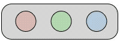

# LEDs
This page contains an overview of the meaning of the LEDs on the boards.
We make a distinction between anchors and tags.
:::warning Note
Not all boards have the same amount of visible LEDs.
The green and red led are always available on all boards. Some boards have some extra LEDs. For full reference, check our hardware page.
:::

## General
### Bootloader
 - `Meaning:` The tag is in the bootloader.
 - `Pattern:` G (0.5) -> Off (0.5) -> start

### Firmware Loader
 - `Meaning:` The tag is in the firmware loader.
 - `Pattern:` R (0.5) -> Off (0.5) -> start

### Heartbeat
 - `Meaning:` The board is in the normal Firmware mode and all is functioning well.
 - `Pattern:` G (0.05) -> Off (0.05) -> G (0.05) -> Off (0.75) -> start

### BLE
#### Unconnected
 - `Meaning:` The tag has BLE activated but no connection is established.
 - `Pattern:` B (0.5) -> Off (0.5) -> start

#### Connected
 - `Meaning:` The tag has BLE activated and has established a connection. This state will stay the same until the connection is lost.
 - `Pattern:` B (inf)

### Panic
 - `Meaning:` The kernel of the board has gone into panic mode (aka something went horribly wrong :|).
 - `Pattern:` R & G (0.1) -> Off (0.1) -> start

## Anchors

## Tags

### Heartbeat

### Charging

### Fully Charged

## Decawave
There are also 2 LEDs connected to the Decawave. They indicate whether the board is transmitting or receiving. Keep in mind that these are 2 different LEDs than the ones used above.

### Receive
 - `Meaning:` The Decawave transponder is in receive state.
 - `Pattern:` R () -> Off() -> start

 

### Transmit
 - `Meaning:` The Decawave transponder is in transmit state.
 - `Pattern:` G () -> Off() -> start

 