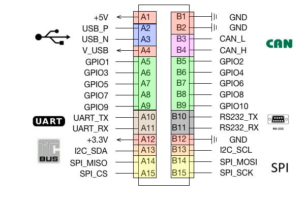
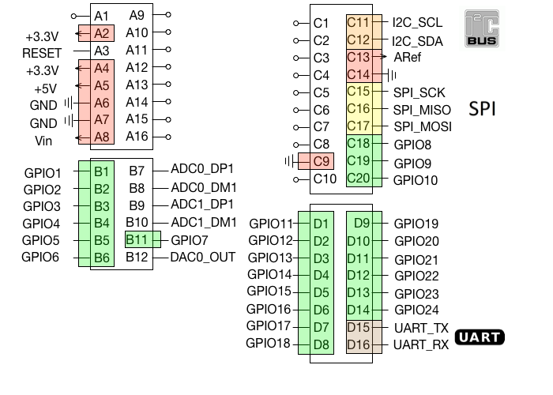
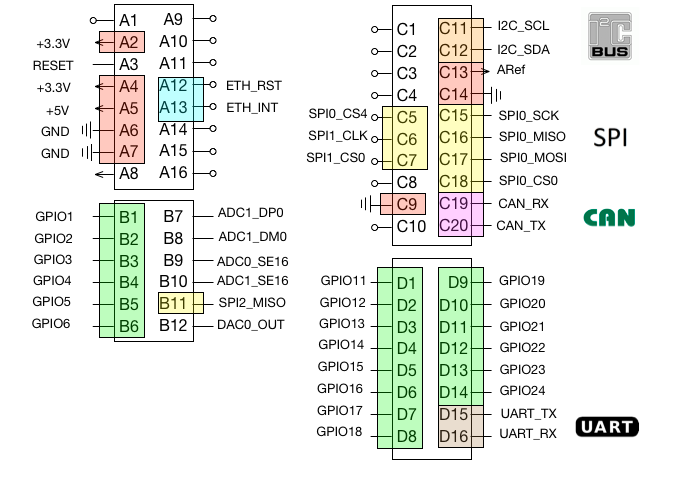

# Pinouts
We offer several tags that you can integrate in your own hardware.

## PCB Edge
An external electrical connection is made via metallic tracks on the edge of the PCB that engage with the contacts in the corresponding socket.

### Jupiter
The Jupiter tag is equipped with a custom RTLOC PCB edge connection with the following pinout. There is support for `UART`, `RS-232`, `SPI`, `I2C`, `CAN` and `USB`.

## Header

### FRDM
Our FRDM Shield can be put on basically any Arduino-compatible board (e.g. the NXP FRDM development boards). The pinout for from these boards is passed through the header on the shield.
Besides the headers, these boards also have a micro-USB (type B) port on-board through which you can also provide power.

### Titan
Do you need a board with a lot (like.. a lót) of interface capability? Then the Titan anchor is probably what you're looking for. It has an Arduino compatible pinout. Some of the GPIO pinning however is slightly different than on the FRDM board.

This board also has a micro USB (type B) port through which you can power the board.
Furthermore, the Titan is rocking:
 - 2 relays
 - 3 opto-couplers
 - Ethernet port
 - Multiple buttons and switches
 - CAN port
 - Long range 868 MHz radio.

## Other
### Mars
The Mars tag has 2 buttons and a BLE radio.