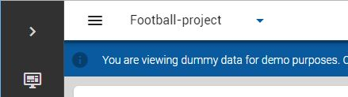

# Clients & projects

A client can have multiple projects, each with their own floor configuration and positioning/sensor data. Different projects can be active at the same time. 

In the web app one project at a time is selected. You can switch between projects from the project selection button:

