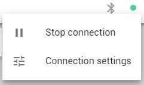
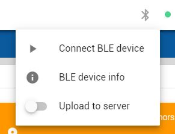

# Data transmission
If your local setup is configured correctly, live positioning data is transported. Other programs (your proprietary software or for example our web app) can then stream this data.

## Project data connection
After you log in, a data connection should automatically be initialized. If successful, the indicator should be green:

> A connection is **project-specific**

## Bluetooth data
You can also get data over Bluetooth. In a regular project this can give you some extra information about the connect tag or anchor. In an ad-hoc or autortls scenario it can be the only source of distance/position information for the dashboard.

## Data control
If you don't want data to be transmitted outside of your local premises, you can easily disable it in our software. You can make a selection on the data to be exported (positioning data, IMU sensor data, ...) or enable/disable it all together.

This can be done a) from the RTLS configurator desktop app