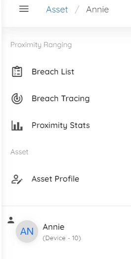
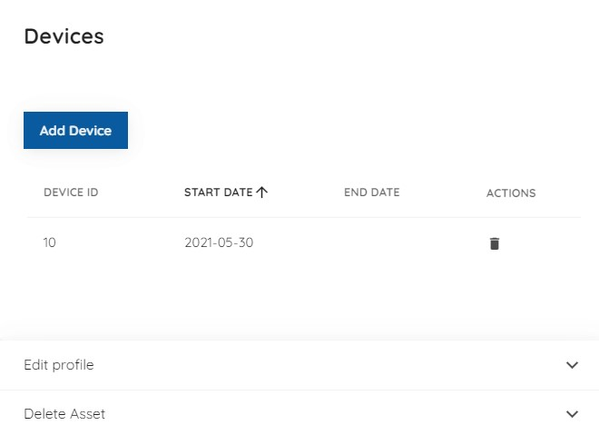
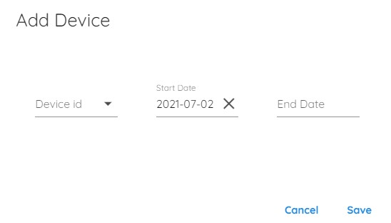
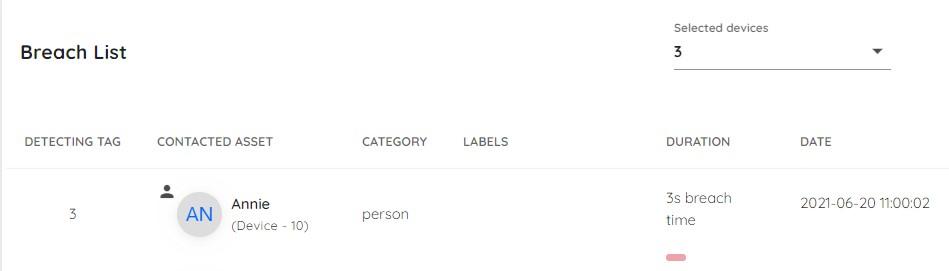
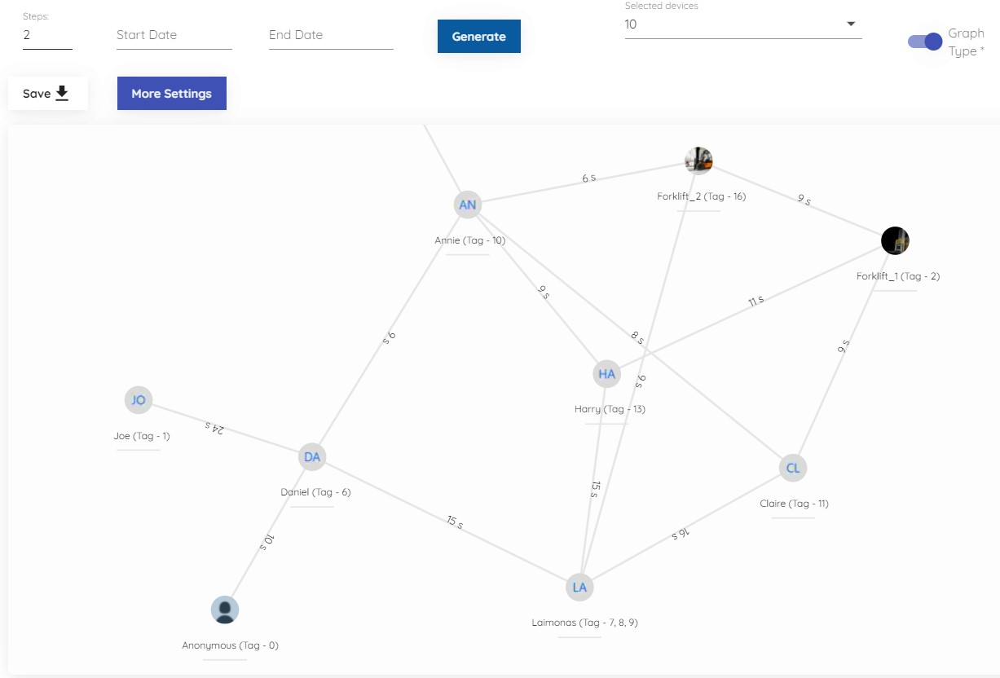
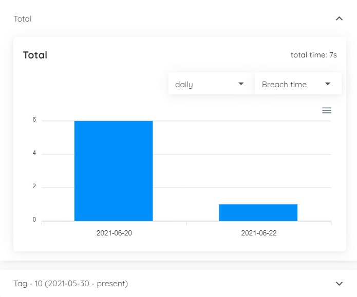

# Devices and assets

## Devices (Tags)

Devices are automatically registered upon sending data to our servers, either by using our [Mobile app](/mobile) or by using the [Desktop app](/manager). Once data is send, all of this data can be viewed in the Portal app.

### Viewing devices

Press on "Devices" in the left navigation screen and choose "Tags".

Here you can view all registered devices. You can see: it's ID, is it active at the moment and to what asset it is assigned to (more on that later). By clicking a button on the right side, you will be able to see more info.

Here you can see: device ID, which hardware it's using, firmware and client ID. You can also edit device alias, device type and color (for positioning). Moreover, you can press "Go to asset" for detailed event information and statistics.

## Assets

Assets are used for assigning devices to some person/vehicle/object/other. You can assign multiple devices to an asset. Assets are generaly used to easily identify something by a more familiar name.

### Viewing assets

Press on "Assets" in the left navigation bar.

Here you can view all assets and create new ones. You can see: name, photo, category, labels, which devices are assigned to the asset. By clicking a button on the right side, you will be taken to the "Asset page" where you are able to see more detailed information about the asset. By clicking on the "New Asset", you will be taken to a form where you can input details and create a new asset.

By clicking the button on the right of the right side, you will be taken to the "Asset details" page.

### Assigning devices

You can assign a device to an asset by going to the "Asset Profile" page.

Once you are there, press on the "Add device" to open a dialog form. Here enter the device ID you want to add, start date (when that asset started using the device), and optionally end date.

### Proximity analysis

#### Breach list

In "Breach list" you all breach event of the asset in a chronological order.

#### Tracing

In "Tracing" you can visually see who breached who and trace them.

#### Stats

In "Stats" you can see summarized statistics of the asset and statistics of each separate device.

