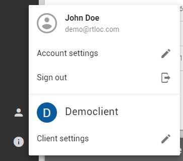

# Settings view

## Client settings

### User access
You can manage the users (e.g. your staff) for your projects. Invited users receive an e-mail to set up their account, and will then have access to the client's projects.

## Project settings
Configure which data will be sent and used outside of your premises.

## User settings
User account settings include profile details as well as app preferences (notifications, info messages).

