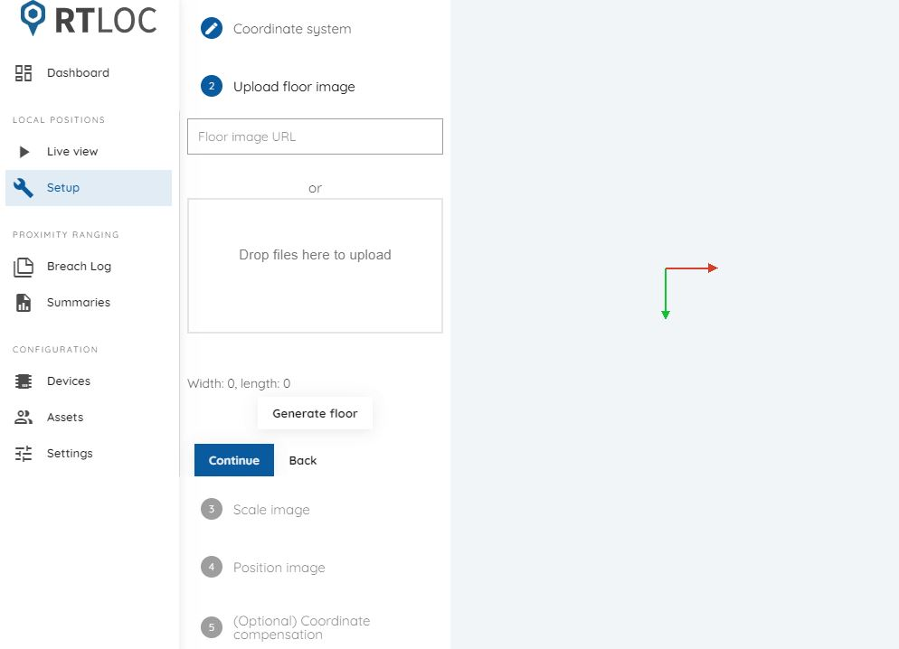
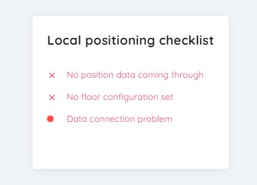

# Local positions

Local position data is displayed on a 2D map. To begin, a floor plan needs to be configured using the setup tab.

## Setup

In the setup tab you can follow a few steps to configure your floor plan. The first step is uploading an image. Supported formats are PNG and JPG. In the next steps you can scale and position the image on the 2D map. There's also the option of choosing the coordinate system's orientation. 

In some cases coordinate compensation can be applied. This will offset the coordinates that arrive from the Manager program (to provide a different center).

## Live view

Until the floorplan configuration is set and a connection is made, the live view tab will show the following error checklist:

Once everything is configured, tag and anchor positions can be viewed on the map.

